 

EST. 2023 &nbsp;§&nbsp; SRM INSTITUTE OF SCIENCE AND TECHNOLOGY

 

 

 

 

 

 

### NOW BUILDING
Client work from my internship. Source is under NDA.

 

  

 

### SELECTED WORK

 

  

 

### THE TIMELINE

 

 

 

### CONTRIBUTIONS

 

<picture>
  <source media="(prefers-color-scheme: dark)" srcset="https://raw.githubusercontent.com/adichebrolu21/adichebrolu21/output/github-snake-dark.svg"/>
  
</picture>

 

<b>📒 Logbook</b> &nbsp;·&nbsp; experience &amp; record

 

`2026` **Hindustan Aeronautics Limited**: Project Management Intern, aerospace operations
`2026` **AeroReason**: research published, Impact Factor 8.072
`2025` **FAST × NVIDIA × SRM**: Founding Member, Head of Corporate Relations
`2025` **National Hackathon**: directed, ₹3,00,000 prize pool, sponsored by BMW / NVIDIA / Belden
`2024` **Coratia Technologies**: Data Science Intern
`2024` **CodeNex "Day 0"**: Top 10, National Hackathon

SAP Certified Data Analyst · NPTEL: Java (IIT Kharagpur), DBMS (IIT Bhubaneswar)

<b>🛠️ Full stack</b>

 

**AI / ML** — PyTorch · XGBoost · scikit-learn · OCR / CV · NLP · TrOCR
**LLMs** — LLaMA3 · Mistral
**Languages & frameworks** — Python · JavaScript · React · FastAPI · Flask · Node.js · Flutter
**Data & hardware** — MongoDB · SQL · NFC / MIFARE DESFire
**Tools** — Git · SAP Analytics Cloud

<b>📊 Activity</b>

 

 

[GitHub](https://github.com/adichebrolu21) &nbsp;·&nbsp; [LinkedIn](https://www.linkedin.com/in/aditya-chebrolu-5a0321277/) &nbsp;·&nbsp; [Email](mailto:adi.chebrolu21@gmail.com)

BENGALURU, INDIA &nbsp;§&nbsp; STILL BUILDING

